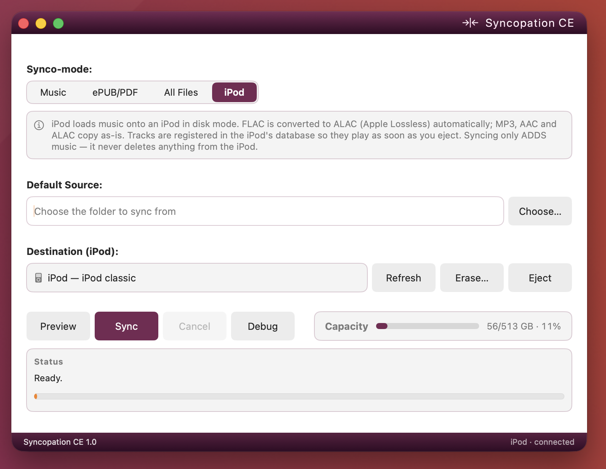

# Syncopation — Community Edition

A native macOS app that copies music, books, or any files onto an SD card, a
folder, or an **iPod** — no iTunes required.

Free and open source under the GPL v3. Built in Swift and SwiftUI with no
dependencies, no runtime, and no Xcode project: a handful of source files
compiled by the Swift compiler that ships with Apple's command line tools.



## What it does

- **Four modes** — Music, ePUB/PDF, All Files, and iPod.
- **iPod support** — recognises the iPod you plug in (model, capacity, and its
  colour), converts FLAC to Apple Lossless so the device can play it, and adds
  the tracks to the iPod's own library. They play as soon as you eject.
- **Syncing only ever adds.** Files already there are skipped; nothing is
  deleted, in any mode.
- **Erase** — the one way to clear a card or wipe an iPod's music, as a
  deliberate button with a confirmation. Nothing is copied afterwards.
- **Preview** — a dry run listing exactly what would be copied.
- **Safe when things go wrong** — if an iPod is unplugged mid-transfer, the
  sync stops cleanly, and files it had already copied are tidied up on the
  next run rather than left stranded on the device.
- Skips macOS junk files, checks free space before starting, and remembers
  your folders between launches.

## What it's for

The model is simple on purpose: **add music, and press Erase if you want to
start over.** There's no library management to learn, and no way to lose music
by accident.

Album artwork on the iPod, transfers that resume where they left off,
reclaiming space from files other software left behind, and making an iPod
match a folder exactly all live in
[Syncopation Pro](https://github.com/ehajek/Syncopation-Pro).

## Pro vs Community Edition

Same engine, same four modes, same care with the iPod's database. Pro adds
the things that take a library from *copied* to *kept*. Both editions are
at 1.1. What each version repaired and added, release by release:
[RELEASES.md](RELEASES.md).

| | **Pro** | **CE** |
|---|:---:|:---:|
| Four Synco-modes — Music, ePUB/PDF, All Files, iPod | ✓ | ✓ |
| Native iPod database engine — hash58 checksums, tracks play on eject | ✓ | ✓ |
| FLAC → Apple Lossless, 16-bit, in-process | ✓ | ✓ |
| iPod identification | Exact model — "iPod classic (7th gen)" | Family only — "iPod classic" |
| Album artwork on the iPod | ✓ | — |
| Skips tracks already on the device | By tags — even ones another app put there | By file |
| Interrupted sync | Checkpointed — carries on where it stopped | Stops cleanly — tidies up on the next run |
| Reclaims stray files other software left behind | ✓ | — |
| Two-way sync for folders and SD cards | ✓ | — |
| Match Default Source — device mirrors the folder, deletions included | ✓ | — |
| Preview, Erase, Eject, free-space check | ✓ | ✓ |
| Debug drawer — device facts and the per-file log | ✓ | ✓ |
| Interface | Liquid Glass on macOS 26, native controls on 13–15 | Flat, native |
| Distribution | Mac App Store — sandboxed, notarized, reviewed | GitHub — clone it, build it |
| Price | $19.99 once; $24.99 from January 1, 2027 | Free, GPL v3 |
| Conversion runs ahead of the copy — a faster first sync | ✓ | ✓ |
| The Mac stays awake while a sync runs | ✓ | ✓ |
| Space check prices hi-res tracks at their converted size | ✓ | ✓ |
| Synco-pod — podcasts and audiobooks filed as such: resume position, kept out of shuffle, unplayed flag | ✓ | — |
| Appearance — follow the system, or pin light or dark | ✓ | ✓ |
| Liquid Glass and window transparency switchable off | ✓ | n/a — already flat |
| A sound when a sync finishes, in your own alert tone | ✓ | ✓ |
| Match Default Source removes items — episodes and books included, not just songs | ✓ | — |

## Requirements

- macOS 13 (Ventura) or later — Intel or Apple Silicon (universal binary)
- For iPod mode: an iPod in disk mode — classic, nano (through 4th gen),
  video, mini, or photo. (iPod touch and iPhone sync differently and aren't
  supported; nor is the shuffle.)

## Building it (about a minute, once)

**1. Get the Swift compiler.** Open **Terminal** (press `⌘ Space`, type
"Terminal") and run:

```sh
xcode-select --install
```

Click **Install** in the dialog. If it says the tools are already installed,
you're set.

**2. Download this project.** Click the green **Code** button above and choose
**Download ZIP** (then double-click to unpack), or in Terminal:

```sh
git clone https://github.com/ehajek/Syncopation-Community-Edition.git
```

**3. Build it:**

```sh
cd ~/Downloads/Syncopation-Community-Edition
chmod +x build.sh
./build.sh
```

**4. Run it.** Double-click `Syncopation CE.app`, or drag it to your
Applications folder first. Because you built it on your own Mac, macOS trusts
it — no security warnings.

## Using it

1. Pick the **mode** for what you're copying.
2. Choose a **source folder**.
3. Choose the **destination** — a disk or folder, or your iPod.
4. Click **Preview** to see what would happen, then **Sync**.
5. Click **Eject** before unplugging.

## How the iPod support works

Stock iPods only play what's listed in their own binary library file, so
copying files onto one isn't enough. Syncopation writes that library directly —
including the checksum that iPod classics and later nanos require — which is
what lets tracks appear and play without iTunes.

## Sync speed

Two things set the pace of a sync: how fast the iPod can take files, and —
for FLAC — how fast the Mac can convert them. **The older either one is, the
slower it goes.**

- **What's inside the iPod.** Most click-wheel iPods — mini, photo, video,
  and every classic — shipped with a small spinning hard drive, and writing
  thousands of files to one is slow work. An iPod whose drive has been
  swapped for flash storage (an iFlash board with SD or CF cards, for
  example) takes music markedly faster; the nano is flash from the factory.
- **The cable.** These devices are USB 2.0 at best, and the earliest models
  are slower still. On a plain copy, a modern Mac spends most of the sync
  waiting on the iPod.

**FLAC libraries take the longest.** An MP3 or M4A is simply copied; a FLAC
track has to be decoded and re-encoded to Apple Lossless first. That
conversion runs on the Mac, so **the older the Mac, the slower the
conversion** — an Intel machine works through a library far more slowly than
Apple Silicon does. The Mac keeps a few finished tracks ready ahead of the
transfer, so whichever side is slower sets the pace: an old hard-drive iPod
can't absorb converted tracks as fast as a modern Mac produces them, and an
old Mac can't convert them as fast as a flash-modded iPod can take them.
Either way, a first sync of a large FLAC collection can run for hours.
Leave it plugged in until it finishes.

## Files

| File | Purpose |
|------|---------|
| `Syncopation.swift` | The app: interface, syncing, erasing |
| `IPodSync.swift` | Writing to an iPod, and recovering from interruptions |
| `IPodDB.swift` | Reading and writing the iPod's library format |
| `AudioConvert.swift` | FLAC → Apple Lossless, in-process |
| `AudioMetadata.swift` | Reading tags and audio properties |
| `IPodModels.swift` | Identifying which iPod is connected |
| `build.sh` | Builds `Syncopation CE.app` |

## Licence

GNU General Public License v3.0 — see [LICENSE](LICENSE).

- The app icon uses the `arrows-collapse-vertical` glyph from
  [Bootstrap Icons](https://icons.getbootstrap.com/) (MIT).
- The iPod library format and its checksum were documented by the
  [libgpod](https://github.com/gtkpod/libgpod) project, whose device tables
  also identify which iPod is connected.
- iPod is a trademark of Apple Inc. This project isn't affiliated with or
  endorsed by Apple.
